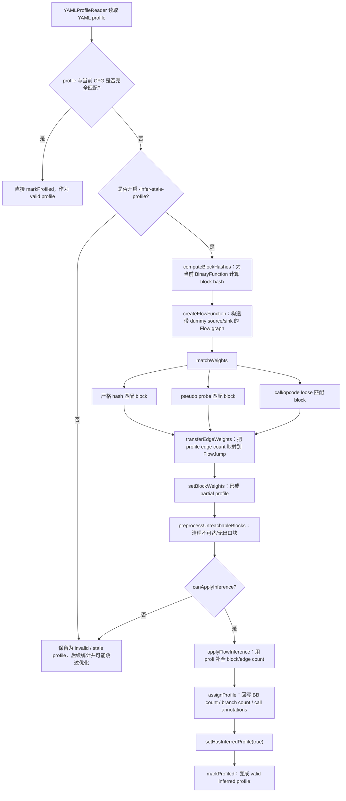

# BOLT Stale Profile Matching Notes

## 1. 背景

BOLT 经常需要处理“采样时使用的 binary 版本落后于当前待优化 binary 若干 revision”这种情况。  
这时函数级 profile 往往不能再和当前 CFG 完全一一对应，BOLT 会把这类 profile 视为可能 stale 的 profile。

`bolt/lib/Profile/StaleProfileMatching.cpp` 的文件头已经直接说明了它的目标：

- 先尽可能把 stale profile 中还能对应上的 block / edge 信息匹配到当前 CFG 上
- 再通过基于 flow 的 profile inference，把局部匹配出的信息补全成可用的 block / edge count

换句话说，BOLT 对 stale profile 的处理，不只是“检测并丢弃”，而是尽量做：

1. matching
2. inference
3. 回写修正后的 profile

** Note: Stale Profile仅针对yaml格式的profile生效；对于fdata格式的profile，llvm-bolt执行完全不同的处理方案，且一旦不匹配，就会标记为不匹配，不执行stale profile。 **

---

## 2. stale profile 的实现主要在哪些目录和文件

### 2.1 核心实现目录

核心实现主要在 `bolt/lib/Profile`。

最重要的文件有：

- `bolt/lib/Profile/StaleProfileMatching.cpp`
  - stale profile 的主实现文件
  - 包含 block matching、edge weight transfer、flow inference、profile 回写
  - 关键入口是 `YAMLProfileReader::inferStaleProfile()`

- `bolt/lib/Profile/YAMLProfileReader.cpp`
  - 负责读取 YAML profile
  - 当 profile 与当前函数 CFG 不能完全匹配时，决定是否触发 stale profile inference
  - `parseFunctionProfile()` 中会在 mismatch 时调用 `inferStaleProfile()`

- `bolt/lib/Profile/CMakeLists.txt`
  - 可以看到 `StaleProfileMatching.cpp` 被编进 `LLVMBOLTProfile`
  - 说明 stale profile matching 逻辑属于 BOLT 的 profile 处理层

### 2.2 辅助实现目录

下面这些文件不是 stale profile 的主入口，但属于关键支撑层：

- `bolt/lib/Core/HashUtilities.cpp`
  - 提供 stale matching 需要的 block loose hash 和 call hash
  - 例如 `hashBlockLoose()`、`hashBlockCalls()`

- `bolt/include/bolt/Profile/YAMLProfileReader.h`
  - 声明了 `profileMatches()` 和 `inferStaleProfile()`

- `bolt/include/bolt/Core/BinaryFunction.h`
  - 定义 profile 状态接口
  - 例如 `hasProfile()`、`hasValidProfile()`、`markProfiled()`、`hasInferredProfile()`

- `bolt/include/bolt/Core/BinaryContext.h`
  - 定义 binary 级别 stale profile 统计字段
  - 例如 `NumStaleProfileFuncs` 以及 `Stats.NumExactMatchedBlocks` 等字段

### 2.3 统计、告警、阈值控制

stale profile 的核心匹配逻辑不在 `bolt/lib/Passes`，但统计和告警是在这里消费的：

- `bolt/lib/Passes/BinaryPasses.cpp`
  - 定义 `-report-stale`
  - 定义 `-stale-threshold`
  - 在 `PrintProgramStats::runOnFunctions()` 中统计：
    - stale functions
    - inferred functions
    - stale sample 占比
    - 是否超过阈值并报错退出

### 2.4 相关测试

测试主要在 `bolt/test/X86`，例如：

- `reader-stale-yaml.test`
- `reader-stale-yaml-std.test`
- `infer_no_exits.test`
- `stale-matching-min-matched-block.test`
- `match-blocks-with-pseudo-probes.test`
- `match-blocks-with-pseudo-probes-inline.test`
- `match-functions-with-call-graph.test`
- `match-functions-with-calls-as-anchors.test`

### 2.5 最小必看文件集

如果只想抓主线，建议先看这 4 个文件：

1. `bolt/lib/Profile/StaleProfileMatching.cpp`
2. `bolt/lib/Profile/YAMLProfileReader.cpp`
3. `bolt/lib/Core/HashUtilities.cpp`
4. `bolt/lib/Passes/BinaryPasses.cpp`

---

## 3. 整体调用链

stale profile 的主调用链可以概括为：

```text
YAMLProfileReader::parseFunctionProfile()
  -> mismatch detected
  -> YAMLProfileReader::inferStaleProfile()
      -> BinaryFunction::computeBlockHashes()
      -> createFlowFunction()
      -> matchWeights()
          -> initMatcher()
          -> matchBlocks()
          -> transferEdgeWeights()
          -> setBlockWeights()
      -> preprocessUnreachableBlocks()
      -> canApplyInference()
      -> applyInference()
      -> assignProfile()
  -> BF.markProfiled(...)
```

---

## 4. 触发 stale profile inference 的位置

触发点在 `bolt/lib/Profile/YAMLProfileReader.cpp`。

在 `parseFunctionProfile()` 中，BOLT 会先尝试把 YAML profile 直接贴到当前 `BinaryFunction` 上：

- block 是否对得上
- call site 是否对得上
- edge 是否对得上

如果 block / call / edge 中有任一项 mismatch，则：

- `ProfileMatched` 变成 `false`
- 如果没有打开 `-infer-stale-profile`，则直接返回 `false`
- 如果打开了 `-infer-stale-profile`，就调用 `inferStaleProfile()`

因此，`YAMLProfileReader.cpp` 是 stale profile 处理的触发层，而不是主要算法实现层。

---

## 5. `inferStaleProfile()` 主流程

`YAMLProfileReader::inferStaleProfile()` 定义在 `bolt/lib/Profile/StaleProfileMatching.cpp` 中，是 stale profile 处理的核心入口。

它的大致流程如下：

1. 检查 `BF.hasCFG()`
2. 重新计算当前 binary function 的 block hash
3. 根据当前函数 layout 构造 flow graph
4. 尽量把 stale profile 中还能对应上的 block / edge 信息映射到 flow graph
5. 对不适合分配流量的块做预处理
6. 检查是否满足推断条件
7. 调用 LLVM 的 flow inference 例程补全 profile
8. 将推断得到的 block / edge / call-site count 回写到 `BinaryFunction`
9. 将该函数标记为 inferred profile

---

## 6. 关键步骤拆解

### 6.1 `BinaryFunction::computeBlockHashes()`

这一步会为当前 binary 中的每个 basic block 计算 blended hash。

其核心组成包括：

- block offset
- 指令级 strict hash
- opcode 级 loose hash
- predecessor hash
- successor hash

这里依赖 `bolt/lib/Core/HashUtilities.cpp` 中的辅助函数：

- `hashBlock()`
- `hashBlockLoose()`
- `hashBlockCalls()`

设计目的很明确：

- strict hash 用来识别“完全相同的块”
- loose hash 用来识别“发生轻微变化但仍高度相似的块”
- call hash 可在 opcode 粗粒度信息不够时提供额外锚点

---

### 6.2 `createFlowFunction()`

`createFlowFunction()` 会把当前函数 CFG 包装成 `FlowFunction`，供后续 inference 使用。

这个 flow graph 有两个额外构造：

- dummy source
- dummy sink

这样设计的原因是：

- 强制整个函数图具有统一入口
- 强制整个函数图具有统一出口
- 方便后续流量平衡与 network-flow 风格的 profile inference

这个 `FlowFunction` 中：

- `Func.Blocks[0]` 是 dummy source
- 中间的 blocks 对应函数真实 basic blocks
- 最后一个 block 是 dummy sink

同时会为：

- 普通 successor edge
- exit 到 dummy sink 的 edge
- landing pad edge

都建立对应的 `FlowJump`

---

### 6.3 `matchWeights()`

`matchWeights()` 是 stale profile matching 的“第一阶段”核心。

它的职责是：

- 把 profile block 尽可能映射到当前 CFG block
- 把 profile edge count 尽可能映射到当前 CFG edge
- 给 flow inference 提供初始的 partial profile

它内部主要分三步：

1. `initMatcher()`
2. `matchBlocks()`
3. `transferEdgeWeights()` + `setBlockWeights()`

---

### 6.4 `initMatcher()`

`initMatcher()` 会为当前函数构造 `StaleMatcher`。

它会准备：

- 当前 binary block 对应的 `FlowBlock`
- 每个 block 的 blended hash
- 每个 block 的 call hash
- 如果开启 pseudo probe matching，还会建立 pseudo probe 到 `FlowBlock` 的映射

换句话说，这一步是在给“profile block 找当前 CFG 中最相似的 block”建立索引结构。

---

### 6.5 `StaleMatcher`

`StaleMatcher` 是 block matching 的核心对象。

它支持几种匹配方式：

- `MATCH_EXACT`
  - 严格 hash 匹配

- `MATCH_PROBE_EXACT`
  - pseudo probe 精确匹配

- `MATCH_PROBE_LOOSE`
  - pseudo probe 非唯一但仍可接受的匹配

- `MATCH_CALL`
  - 基于 call hash 的匹配

- `MATCH_OPCODE`
  - 基于 opcode loose hash 的匹配

- `NO_MATCH`
  - 无法匹配

`StaleMatcher` 的主要接口有：

- `matchBlockStrict()`
- `matchBlockProbe()`
- `matchBlockLoose()`

对应的思路是：

1. 先尝试高置信度匹配
2. 再尝试 probe 相关匹配
3. 最后退化到 call hash / opcode hash 等较宽松策略

---

### 6.6 `matchBlocks()`

`matchBlocks()` 负责把 YAML profile 中的 block 映射到当前函数的 `FlowBlock`。

它的大致顺序是：

1. 先按 strict hash 匹配
2. 再按 pseudo probes 匹配
3. 最后按 loose 方法匹配

其中 loose 方法包括：

- call hash
- opcode loose hash

如果 profile 的 entry block 仍然无法匹配，它还会兜底地把 profile block 0 对到当前函数的 entry block，并把这种情况记为 loose match。

这个函数还负责更新 binary 级别的 stale matching 统计信息，例如：

- `NumStaleBlocks`
- `NumExactMatchedBlocks`
- `NumPseudoProbeExactMatchedBlocks`
- `NumPseudoProbeLooseMatchedBlocks`
- `NumCallMatchedBlocks`
- `NumLooseMatchedBlocks`
- 各类 matched sample count

因此，`matchBlocks()` 不只是做映射，还承担 stale profile 质量统计的职责。

---

### 6.7 `transferEdgeWeights()`

当 profile block 已经部分匹配到当前 CFG block 后，`transferEdgeWeights()` 会尝试把 profile 中的 edge count 也搬运过来。

逻辑很直接：

- 若 profile 的 src / dst block 都成功匹配到了当前 flow graph 中的 block
- 且当前 flow graph 中确实存在这条 jump
- 就把这条 profile edge 的 count 赋给该 `FlowJump`

同时它还会统计：

- 每个 block 的 `OutWeight`
- 每个 block 的 `InWeight`

供下一步给 block 赋初值使用。

---

### 6.8 `setBlockWeights()`

`setBlockWeights()` 会根据 `OutWeight` 和 `InWeight` 给 block 赋初始 weight。

规则是：

- 如果某个 block 的 in/out weight 都为 0，则保持 unknown
- 否则用 `max(OutWeight, InWeight)` 作为 block 初始 weight

它的返回值是“成功分配初始 weight 的 block 数量”，后面会被拿来判断是否允许继续做 inference。

---

### 6.9 `preprocessUnreachableBlocks()`

这一步用于在正式做 flow inference 前清洗图。

它会找出两类信息：

- 从入口可达的块
- 能够通向出口的块

如果某个 block：

- 有正 weight
- 但不满足“从入口可达且能到出口”

则会被标记为：

- `Weight = 0`
- `HasUnknownWeight = true`
- `IsUnlikely = true`

目的很明确：避免 profi 把流量错误地送到这些不应该承载真实执行流的块上。

---

### 6.10 `canApplyInference()`

不是所有 mismatch function 都会进入 inference。

`canApplyInference()` 会做至少三类限制：

- 函数不能太大
  - 受 `-stale-matching-max-func-size` 控制

- matched block 比例要达到阈值
  - 受 `-stale-matching-min-matched-block` 控制

- CFG 结构必须像一个可做推断的 flow graph
  - 例如必须存在合法出口

如果这些条件不满足，BOLT 会放弃 inference，把该函数保留为 invalid / stale profile。

---

### 6.11 `applyInference()`

`applyInference()` 会设置一组 `ProfiParams`，然后调用 LLVM 的：

- `applyFlowInference()`

这里说明了一个很关键的设计点：

- BOLT 自己负责 stale profile 的 block / edge matching
- 真正的 flow 补全算法复用了 LLVM 通用的 sample profile inference 基础设施

参数项包括：

- `EvenFlowDistribution`
- `RebalanceUnknown`
- `JoinIslands`
- 各种 block / jump increase / decrease cost

这些参数由一组 `stale-matching-*` hidden / really-hidden 选项控制。

---

### 6.12 `assignProfile()`

一旦 inference 完成，`assignProfile()` 会把结果真正回写回 `BinaryFunction`。

它会更新：

- 每个 BB 的 execution count
- 每条 branch 的 count
- landing pad 执行次数
- 直接 call 的 `Count` annotation
- conditional tail call 的 `CTCTakenCount`
- indirect call / indirect branch 的 `CallProfile`

最后还会：

- 更新函数级 execution count
- 调用 `BF.setHasInferredProfile(true)`

这一步是 stale profile 从“部分匹配出的中间图信息”落地成“BOLT 后续优化 pass 可消费的 profile 数据”的关键。

---

## 7. inference 成功后如何把函数变成 valid profile

`inferStaleProfile()` 返回 `true` 后，控制流回到 `YAMLProfileReader.cpp`。

随后 `parseFunctionProfile()` 会调用：

- `BF.markProfiled(YamlBP.Header.Flags)`

这一步会：

- 确保函数有 execution count
- 设置 `ProfileFlags`
- 把 `ProfileMatchRatio` 设为 `1.0f`

于是这个函数就不再被视为 invalid profile，而成为：

- valid profile
- 且带有 `HasInferredProfile = true`

---

## 8. BOLT 是如何表示 stale / valid / inferred profile 的

这里有一个很容易误解的点：

BOLT 并没有单独维护一个简单的 `IsStale` 布尔位来标记函数。

它实际上依赖下面几个状态接口：

- `hasProfile()`
  - 只表示函数有 profile
  - 即使 profile 与当前 CFG 不能 100% 对上，也可能返回 true

- `hasValidProfile()`
  - 表示 profile 可被认为是准确的
  - 当前实现上等价于：
    - `ExecutionCount != COUNT_NO_PROFILE`
    - `ProfileMatchRatio == 1.0f`

- `hasInferredProfile()`
  - 表示原始输入 profile 并不准确，但已经被 stale profile inference 修正

因此可以把状态粗略理解为：

- `hasProfile() && !hasValidProfile()`
  - stale / invalid profile

- `hasValidProfile() && hasInferredProfile()`
  - 原本 stale，但经过 inference 修正后的 profile

---

## 9. `BinaryPasses.cpp` 如何消费这些状态

`bolt/lib/Passes/BinaryPasses.cpp` 不是 stale matching 的实现层，但它决定了这些状态在整个 BOLT 流水线中如何被呈现给用户。

主要有两类逻辑：

### 9.1 选项定义

- `-report-stale`
  - 打印 stale function 列表

- `-stale-threshold`
  - 设置可容忍 stale function 百分比阈值

### 9.2 统计逻辑

在 `PrintProgramStats::runOnFunctions()` 中：

- 如果 `Function.hasValidProfile()`
  - 说明这是可消费 profile
  - 若同时 `Function.hasInferredProfile()`
    - 说明它属于“从 stale profile 修复而来”的 inferred profile

- 如果 `Function.hasProfile()` 但 `!Function.hasValidProfile()`
  - 说明这还是 stale / invalid profile

它会据此统计：

- stale function 数量
- inferred function 数量
- stale sample 数量
- stale sample 在全局样本中的占比

如果 stale 比例超过 `-stale-threshold`，还会报错退出。

---

## 10. 关键命令行选项

和 stale profile 直接相关的选项主要包括：

- `-infer-stale-profile`
  - 打开 stale profile inference

- `-stale-matching-min-matched-block`
  - 只有匹配到足够比例 block 的函数才会进入 inference

- `-stale-matching-max-func-size`
  - 限制参与 inference 的最大函数规模

- `-stale-matching-with-pseudo-probes`
  - 打开基于 block pseudo probe 的 stale matching

- `-report-stale`
  - 打印 stale functions

- `-stale-threshold`
  - stale function 百分比阈值

另外还有一系列更细粒度的 inference 参数，例如：

- `-stale-matching-even-flow-distribution`
- `-stale-matching-rebalance-unknown`
- `-stale-matching-join-islands`
- `-stale-matching-cost-block-inc`
- `-stale-matching-cost-block-dec`
- `-stale-matching-cost-jump-inc`
- `-stale-matching-cost-jump-dec`

这些主要用于调节 profi 的代价模型。

---

## 11. 一句话总结

BOLT 对 stale profile 的处理可以分成三层：

1. `bolt/lib/Profile`
   - 核心实现层
   - 负责 mismatch 检测、block matching、flow inference、profile 回写

2. `bolt/lib/Core`
   - 支撑层
   - 负责 block hash、call hash、profile 状态字段等基础设施

3. `bolt/lib/Passes`
   - 消费层
   - 负责 stale profile 的统计、打印、阈值控制和是否允许继续优化

如果只记主线，可以记成：

```text
YAMLProfileReader 负责发现 stale
StaleProfileMatching 负责修复 stale
BinaryPasses 负责统计和报告 stale
```

---

## 12. YAML / fdata / perf.data 对比

下面这张表用于区分三个很容易混淆的问题：

1. BOLT 是否能读取这种 profile
2. 这种 profile 走哪条 reader 路径
3. 是否支持 `StaleProfileMatching.cpp` 这套 stale profile matching / inference

| 输入格式 | 典型来源 | Reader / 入口 | 主要匹配方式 | 是否支持 `-infer-stale-profile` 这套 stale 修复 | 备注 |
|---|---|---|---|---|---|
| YAML | BOLT YAML profile | `YAMLProfileReader` | 函数名 / hash / call graph / pseudo probe / block hash | 是 | 这是 `StaleProfileMatching.cpp` 的专属路径 |
| fdata | `perf2bolt` 生成的 `.fdata`，或 instrumentation 产出的 offset-based profile | `DataReader` | 函数名 + offset / CFG branch legality 校验 | 否 | 只会计算 `ProfileMatchRatio`，不会进入 stale block matching + inference |
| perf.data | Linux perf 原始采样数据 | `DataAggregator` | 先聚合事件，再直接附着 branch/basic sample 数据 | 否 | 读取是支持的，但 `llvm-bolt` 非 `-aggregate-only` 直读会给出 unsupported warning |

### 12.1 YAML

YAML 输入走 `YAMLProfileReader`：

- `RewriteInstance::setProfile()` 会先判断文件内容
- 若 `YAMLProfileReader::isYAML(Filename)` 为真，则创建 `YAMLProfileReader`
- 当 `parseFunctionProfile()` 发现 block / call / edge mismatch 时：
  - 若没有打开 `-infer-stale-profile`，直接返回 invalid profile
  - 若打开了 `-infer-stale-profile`，则调用 `inferStaleProfile()`

因此：

- YAML 是 stale profile matching 的主战场
- `StaleProfileMatching.cpp` 也是专门为这条路径服务的

### 12.2 fdata

`.fdata` 输入不走 `YAMLProfileReader`，而是走 `DataReader`。

`DataReader` 的做法是：

- 先按函数名把 branch/basic sample/mem profile 贴到函数上
- 在 LBR 模式下，通过 `matchProfileData()` 计算 `ProfileMatchRatio`
- 通过 `evaluateProfileData()` 检查记录下来的 branch 是否能合法映射到当前 CFG

也就是说，`.fdata` 侧确实也有“匹配”和“一定程度的推断”：

- LBR 模式下，主要是按 branch 记录回填 CFG，再从边推出块
- no_lbr/basic samples 模式下，先按地址样本聚合到块，再推断边

但它不属于 `StaleProfileMatching.cpp` 这套 stale profile 修复机制。

换句话说：

- `.fdata` 可以被读取
- `.fdata` 可以做普通 profile attach 和合法性检查
- `.fdata` 不会触发 `inferStaleProfile()`
- `-infer-stale-profile` 对 `.fdata` 没有实际效果

如果 `.fdata` 和当前 CFG 不能完全对上，结果通常是：

- 函数仍然可能 `hasProfile()`
- 但未必 `hasValidProfile()`
- 不会像 YAML 那样进入 block-hash + flow-inference 的 stale 修复路径

### 12.3 perf.data

`perf.data` 走 `DataAggregator`，不是 `YAMLProfileReader`，也不是 `DataReader`。

这条路径的主要思路是：

- 先解析 perf 原始事件
- 再聚合成 branch/basic/mem 数据
- 然后把有事件的函数直接标成 valid profile

这条路径同样不会进入 `StaleProfileMatching.cpp`。

需要注意的是：

- `llvm-bolt` 直接读 `perf.data` 在非 `-aggregate-only` 模式下会打印 warning
- 官方推荐路径仍然是先聚合，再给 BOLT 使用

### 12.4 一句话结论

可以把三者的区别记成：

```text
YAML: 支持 stale profile matching / inference
fdata: 只支持普通 profile 匹配与校验，不支持 YAML 那套 stale 修复
perf.data: 走聚合器路径，也不支持 YAML 那套 stale 修复
```

---

## 13. stale profile matching 简化流程图

下面这张图只描述当前 BOLT stale profile matching 的主算法逻辑，省略了一些实现细节。



也可以用一句话概括成：

```text
先匹配，后推断，最后回写。
```
